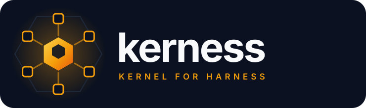

<p align="center">
  
</p>

<p align="center">
  <strong>Kerness — Kernel for Harness.</strong><br>
  The framework an AI harness sits on, assembled from plug-and-play components.<br>
  A Rust crate, with Python bindings over the same kernel.
</p>

<p align="center">
  <a href="https://github.com/xwings/kerness/actions/workflows/ci.yml"></a>
  <a href="LICENSE"></a>
  
  
</p>

---

## What Kerness is

A **harness** is everything wrapped around a language model that turns it into a
working system: who speaks and in what order, which tools are reachable, what
counts as finished, what gets remembered, and what the run finally returns. A
debate between three agents is a harness. A research pipeline is a harness. A
code-review bot, a negotiation simulator, a poker table with three seats — all
harnesses.

Building one from scratch means writing the same substrate every time. Provider
transport and retries. Tool-call parsing across three incompatible dialects.
Prompt assembly. A turn loop with phases and termination conditions. Access
control on anything that touches the filesystem. Memory. Context compaction.
Crash-resumable state. That substrate is where the weeks go, and none of it is
the harness you actually wanted to build.

**Kerness is that substrate — the kernel.** It owns every piece listed above and
exposes them as components you plug together. What is left for you is the part
that is genuinely yours: a Markdown file declaring how your harness behaves, and
whatever tools you want to hand the agents.

The name is the design: a **ker**nel for a har**ness**.

### Two artifacts, one kernel

Kerness is a **Rust crate**. `crates/kerness/` links no Python, spawns no
threads, and runs a whole session on the calling thread — a stack trace from
inside a tool handler reaches back to `Session::run`.

`bindings/python/` is a **binding**: a thin PyO3 layer that decides nothing.
It forwards into the same kernel, so a session driven from Python takes the same
code path as one driven from `main()`. What Python adds is what Python callers
expect — a `Provider` you subclass, a lambda as a tool handler, a `pydantic`
model for structured output.

Neither surface is a wrapper around the other's use case, and neither is the
"real" one. Pick the language; the framework is the same.

### The split

| The kernel owns | Your harness declares |
| --- | --- |
| Provider transport, retries, backoff | Which models each agent uses |
| Tool dialects (OpenAI / Anthropic / text-fence) | Which tools exist and what they do |
| Prompt assembly and ordering | Personas, system prompts, language |
| The orchestrator loop, phases, turn counting | Phase names, round counts, instructions |
| Termination detection | Which tokens end a run |
| Access decisions on commands and paths | The policy those decisions are made against |
| Memory read/write, context compaction | Whether the run may write memory |
| Session files and resume | Where the state file lives |
| Skill discovery and progressive disclosure | Which skills an agent may load |

Nothing in the left column is something you should have to write again. Nothing
in the right column is something the framework should decide for you.

## Plug-and-play components

Every component is an interface with a working default. Use the default, or
swap in your own — the rest of the kernel does not notice.

| Component | Ships with | Swap it by |
| --- | --- | --- |
| **Provider** | `OpenAiProvider`, `ClaudeProvider`, `OpenRouterProvider`, `CustomProvider`; OAuth credentials where the vendor offers them | implementing the `Provider` trait — one required method, `chat` |
| **Channel** | `ConsoleChannel`, `FileChannel`, `LogChannel`, `MultiChannel` | implementing `Channel` — one required method, `send` |
| **Tools** | `cmd`, `read_file`, `list_dir`, `write_memory` | `session.add_tool(name, description, parameters, handler)` |
| **Skills** | `challenge`, `fact-check`, `summarize`, `agent-browser` | dropping a `SKILL.md` directory on disk |
| **Personas** | `pragmatic_engineer`, `devils_advocate` | a `.md` file, or inline prose |
| **Gameplans** | `debate`, `discussion`, `research` | a new Markdown file — see below |
| **Access** | closed by default; allow-lists for programs, patterns, directories | an `AccessPolicy`, plus an approval callback |
| **Memory** | a plain `.md` file, read-only unless asked | point `memory` anywhere; per-agent scopes supported |
| **Session file** | JSON snapshot after every turn | `session_file` — absent means persist nothing |

The names are the Rust ones. Python spells the two acronym providers the way
Python callers expect — `OpenAIProvider`, plus `OpenAIOAuthProvider` and
`ClaudeOAuthProvider` — and a trait to implement becomes a class to subclass;
everything else carries the same name in both.

A `CustomProvider` pointed at any OpenAI-compatible endpoint covers most local
inference servers without implementing anything at all.

Providers may speak native tool calling or fall back to text fences. The dialect
is resolved **per agent**, so one session can mix an Anthropic model, an OpenAI
model, and a local endpoint that supports no tool calling at all, and the
orchestrator sees one normalized stream of calls.

## A harness is a Markdown file

The YAML frontmatter is a machine-readable contract the framework validates and
enforces. The body below it is the orchestrator's manual, in prose.

```yaml
---
name: debate
description: Adversarial debate, then a revisit against a neutral summary.
agents:
  orchestrator: { required: true }
  participants: { min: 2, max: 6 }
loop:
  max_turns: 50
  max_rounds: 3
  terminate_on: [END_SESSION, CONSENSUS_REACHED]
  phases:
    - name: think
      rounds: 1
      instruction: Give your own independent opinion. Do not rebut anyone yet.
    - name: argue
      rounds: 2
      instruction: Choose a side and present a forceful argument for it.
    - name: rethink
      rounds: 1
      rethink: true
      instruction: Re-examine your opening position against the summary.
result:
  consensus: { type: bool, description: Whether participants converged. }
  summary:  { type: str,  description: The final neutral summary. }
---

# Debate

You are running an adversarial debate. Your job is to make the disagreement
productive, not to resolve it prematurely.
```

Everything in that contract is enforced, not advisory: a session with one
participant is refused before the first API call, a `tools:` entry naming a tool
nobody registered is an error rather than a silent drop, and every problem is
reported at once instead of one per run. The declared `result:` fields come back
as typed values on the session result.

A new harness is a new Markdown file. It is not a new runtime, not a subclass,
and not a fork.

## Install

**Rust** — MSRV 1.88, no build script, no system libraries:

```toml
[dependencies]
kerness = { git = "https://github.com/xwings/kerness" }
```

**Python** — `abi3` wheels from CPython 3.10 up, so one build covers every
supported interpreter:

```sh
pip install kerness                  # runtime
pip install 'kerness[structured]'    # plus pydantic, for OpenAIProvider(output_type=...)
```

From a checkout, either side. The root is a Cargo workspace, so a Python build
starts from the binding's own directory:

```sh
cargo test --workspace                           # the kernel

cd bindings/python && maturin develop            # the binding
python -m kerness.selfcheck                      # pass = "OK: all core checks passed"
```

## A run, in Rust

```rust
use std::sync::Arc;
use kerness::{Agent, ConsoleChannel, Role, Session, SessionConfig};
use kerness::provider::{OpenAiConfig, OpenAiProvider};

let provider = Arc::new(OpenAiProvider::new(OpenAiConfig {
    api_key: std::env::var("OPENAI_API_KEY")?,
    ..Default::default()
})?);

let mut session = Session::new(SessionConfig {
    gameplan: "debate".to_string(),
    topic: "Should the cache be write-through?".to_string(),
    provider: Some(provider),
    channel: Some(Arc::new(ConsoleChannel::default())),
    session_file: Some("run.json".to_string()),   // resumable; None persists nothing
    ..Default::default()
})?;

session.add_participant(Agent { persona: "pragmatic_engineer.md".into(), ..Agent::new("Alice", "gpt-4o") });
session.add_participant(Agent { persona: "devils_advocate.md".into(), ..Agent::new("Bob", "gpt-4o") });
session.add_orchestrator(Agent { role: Role::Orchestrator, ..Agent::new("Mod", "gpt-4o") })?;

let result = session.run()?;
println!("{}", result.summary());          // the gameplan's declared `summary` field
println!("{} {} {}", result.consensus_reached, result.rounds_run, result.end_reason);
```

Handing the agents a tool of your own is one call. The handler is a closure:

```rust
use kerness::tooling::Arguments;
use serde_json::{json, Value};

session.add_tool(
    "lookup_price",
    "Look up the current price of a ticker.",
    json!({"type": "object",
           "properties": {"ticker": {"type": "string"}},
           "required": ["ticker"]}),
    Arc::new(|args: &Arguments, _actor: &str| {
        let ticker = args.get("ticker").and_then(Value::as_str).unwrap_or_default();
        Ok(format!("{ticker} is at 41.20"))
    }),
)?;
```

The kernel handles schema translation into whichever dialect the agent's
provider speaks, parsing the call back out, feeding the result in, and stopping
a model that loops on malformed calls.

Full file: [`crates/kerness/examples/debate.rs`](crates/kerness/examples/debate.rs) —
`cargo run -p kerness --example debate`.

To watch a session run without an API key, use
[`offline_debate`](crates/kerness/examples/offline_debate.rs), which drives the
same `debate` gameplan against a scripted provider:

```sh
cargo run -p kerness --example offline_debate    # no key, no network
```

Seven more examples sit beside it — per-agent providers, memory, structured
output, a custom tool, a custom channel, and the access boundary widened for one
program.

## The same run, in Python

The binding mirrors the crate, in the shapes Python callers expect: a keyword
constructor instead of a config struct, a plain callable instead of a closure in
an `Arc`.

```python
from kerness import ConsoleChannel, OpenAIProvider, Session

session = Session(
    gameplan="debate",
    topic="Should the cache be write-through?",
    provider=OpenAIProvider(api_key="..."),
    channel=ConsoleChannel(),
    session_file="run.json",     # resumable; omit to persist nothing
)
session.add_participant("Alice", model="gpt-4o", persona="pragmatic_engineer.md")
session.add_participant("Bob", model="gpt-4o", persona="devils_advocate.md")
session.add_orchestrator("Mod", model="gpt-4o")

result = session.run()
print(result.summary)        # the gameplan's declared `summary` field
print(result.consensus_reached, result.rounds_run, result.end_reason)
```

```python
session.add_tool(
    "lookup_price",
    "Look up the current price of a ticker.",
    {"type": "object",
     "properties": {"ticker": {"type": "string"}},
     "required": ["ticker"]},
    lambda args: str(prices[args["ticker"]]),
)
```

## What the kernel does while it runs

Neither of the above is a different runtime, so the following holds for both.

Skills use progressive disclosure: prompts carry only names and descriptions,
and the full instructions load on demand through a turn-local `Skill` tool. A
skill may also narrow the tools available for that turn, and — when the policy
trusts bundles — grant read access to its own directory.

There is no daemon and no server. A run given a session file writes its state to
disk after every turn and continues from that file the next time the same
program runs. Resume checks identity first: a snapshot from a different gameplan
or a different agent roster is refused, not half-applied.

## Layout

```text
Cargo.toml       # the only manifest at the root
crates/kerness/  # the kernel, pure Rust — no PyO3, no Python
  src/           #   24 modules, 305 unit tests inline
  tests/         #   88 integration tests, over the public API only
  examples/      #   8 runnable Rust harnesses, one needing no key
  assets/        #   bundled gameplans, personas, skills
bindings/python/ # everything the wheel is built from
  pyproject.toml #   the wheel's manifest — `pip install .` runs here
  src/           #   the PyO3 extension module, kerness._core
  kerness/       #   the Python package: shims, deliberate Python, assets
  tests/         #   pytest suite, over the binding
  examples/      #   runnable Python harnesses
ARCHITECTURE/    # one document per subsystem
```

The bundled `debate`, `discussion`, and `research` gameplans are worked examples
of the contract, not the product.

## Testing

Each suite proves its own layer. The Rust integration tests compile against the
crate's public API exactly as a dependent does, so a break in that surface fails
a test here rather than a downstream build; the pytest suite proves the binding
carries the kernel's behaviour across the FFI boundary intact.

```sh
cargo fmt --all -- --check
cargo clippy --workspace --all-targets -- -D warnings
cargo test --workspace                     # 305 unit + 88 integration
cargo build -p kerness --examples          # every example still compiles
cargo run -p kerness --example offline_debate   # a whole session, no key

python -m pytest bindings/python/tests -q      # 394 tests
python -m kerness.selfcheck                    # exit 0
ruff check bindings/python
```

CI runs all of it on every push, on Rust stable and the 1.88 MSRV floor, and on
Python 3.10 and 3.13.

## Documentation

[`ARCHITECTURE.md`](ARCHITECTURE.md) is the entry point: mission, workspace
layout, boot flow, well-known constants, and an index of one document per
subsystem under [`ARCHITECTURE/`](ARCHITECTURE/). Each carries live `file:line`
references and the commands that prove it works.

## License

MIT. See [LICENSE](LICENSE).
